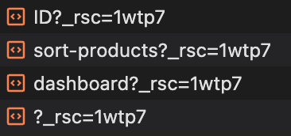

## How Routing and Navigation Works

<strong>※ 라우팅 및 내비게이션 작동 방식</strong>

App Router는 라우팅 및 내비게이션에 대해 하이브리드 접근 방식을 사용합니다.

1. 서버에서 애플리케이션 코드는 경로 세그먼트에 의해 자동으로 코드 분할됩니다.
2. 클라이언트에서 Next.js는 경로 세그먼트를 사전 로드하고 캐시합니다.
3. 사용자가 새 경로로 내비게이션할 때 브라우저가 페이지를 다시 로드하지 않으며 변경된 경로 세그먼트만 다시 렌더링됩니다.

이는 내비게이션 경험과 성능을 향상시킵니다.

### 1. Code Splitting

- 코드분할은 애플리케이션 코드를 더 작은 번들로 나누어 브라우저가 다운로드하고 실행할 수 있게 합니다.
  - 이는 전송되는 데이터 양과 각 요청에 대한 실행 시간을 줄여 성능을 향상시킵니다.
- 웹 페이지가 요청될 때, 즉 HTML 다운로드와 함께 일어납니다.
  - 서버에서 필요한 코드만 전송하여 초기 로딩시간을 줄이고, 사용자 상호작용에 따라 추가 코드가 필요할 때만 로드하도록 합
    니다.
  - HTML 다운로드 단계에서 발생하지만, 필요한 리소스가 동적으로 로드될 때도 발생합니다.

### 2. Prefetching

- 사전 로드는 사용자가 방문하기 전에 백그라운드에서 경로를 미리 로드하는 방법입니다.
- **\<Link> 컴포넌트**
  - 경로가 사용자의 뷰포트에 보이게 되면 자동으로 사전 로드됩니다. 사전 로드는 페이지가 처음 로드될 때 또는 스크롤을 통
    해 뷰에 들어올 때 발생합니다.
- **router.prefetch()**
  - useRouter 훅을 사용하여 프로그래밍 방식으로 경로를 사전 로드할 수 있습니다.

 

- \<Link>의 기본 사전 로드 동작(즉, prefetch prop이 지정되지 않았거나 null로 설정된 경우)은 loading.js의 사용 방식에 따
  라 다릅니다.
- 첫 번째 loading.js 파일까지 렌더링된 "트리"의 공유 레이아웃만 사전 로드되어 30초 동안 캐시됩니다.
  - 이는 전체 동적 경로를 가져오는 비용을 줄여주며, 사용자에게 더 나은 시각적 피드백을 제공하기 위해 즉각적인 로딩 상태
    를 표시할 수 있습니다.

   

\<Link> 태그로 감싼 버튼에 Hover시 해당 내용을 Prefetching (IOS, Chrome기준 3분정도 캐시되는 것으로 보임)
