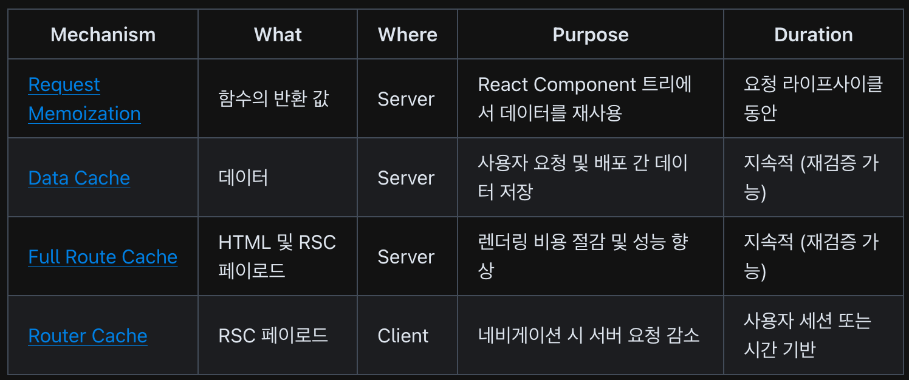
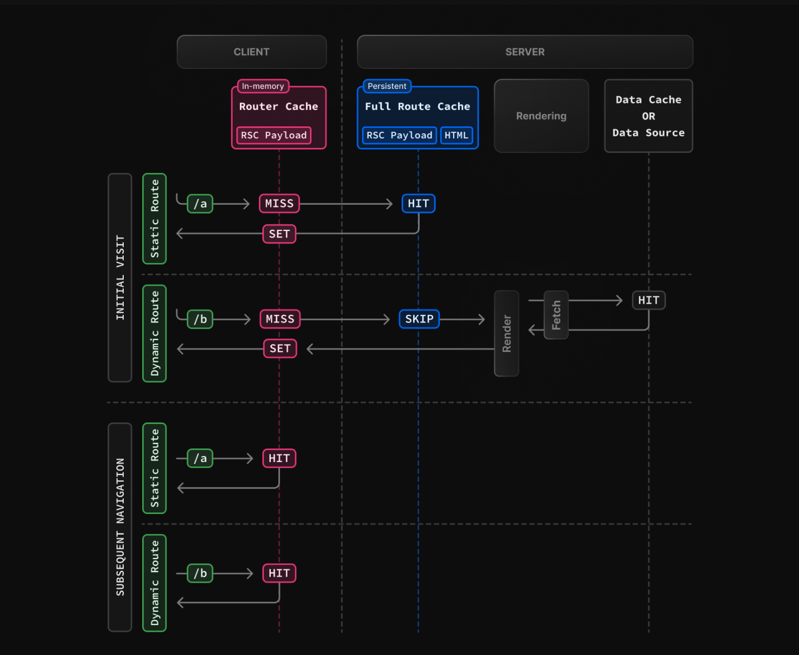

# Caching in Next.js

매우 요약해서 정리 예정

## Overview

## Request Memoization

동일한 URL과 옵션을 가진 요청을 자동으로 메모이제이션하도록 `fetch API` 를 확장.

- 메모이제이션은 fetch 요청의 GET 메서드에만 적용됩니다.
- React 컴포넌트 트리에만 적용
  - `generateMetadata`, `generateStaticParams`, `Layouts`, `Pages` 및 기타 `Server Components`의 `fetch` 요청에 적용

### Duration (지속성)

**초기 페이지 렌더링이 끝날 때까지 유지**

### Revalidating (재검증)

서버 요청 간에 공유되지 않으며 렌더링 중에만 적용되므로 재검증 필요 없음

   

## Data Cache

서버 요청과 배포 간에 데이터 페치를 지속적으로 유지하는 내장 데이터 캐시

- 기본적으로 `fetch`를 사용하는 데이터 요청은 캐싱되지 않습니다
- `force-cache` 옵션이 있는 `fetch` 요청이 렌더링 중 처음 호출되면 데이터 캐시에서 캐시된 응답을 확인

### Duration

선택 해제하지 않는 한 유지

### Revalidating

- 시간 기반
  - `fetch('https://...', { next: { revalidate: 3600 } })`
- 온디맨드 재검증
  - 데이터는 경로(`revalidatePath`) 또는 캐시 태그(`revalidateTag`)에 따라 온디맨드로 재검증

   

## Full Route Cache

빌드 시 자동으로 경로를 렌더링하고 캐싱

1. **React Rendering on the Server**
1. **Next.js Caching on the Server (Full Route Cache)**
   - 경로의 렌더링 결과(RSC Payload와 HTML)를 서버에 캐시
1. **React Hydration and Reconciliation on the Client**
   1. HTML은 클라이언트 및 서버 컴포넌트의 빠른 비상호작용 초기 미리보기를 즉시 보여줌
   1. RSC Payload는 클라이언트 및 렌더링된 서버 컴포넌트 트리를 일치시키고 DOM을 업데이트
   1. 자바스크립트 명령은 클라이언트 컴포넌트를 `hydrate` 하여 상호작용 가능하게 만듦
      - `hydrate`란 HTML 코드와 JavaScript 코드를 서로 매칭 시키는 과정
1. **Next.js Caching on the Client (Router Cache)**
   - RSC Payload는 클라이언트 측 Router Cache에 저장
   - 이전에 방문한 경로를 저장하고 미래의 경로를 프리페치하여 탐색 경험을 향상시키는 데 사용
1. **Subsequent Navigations**
   - RSC Payload가 Router Cache에 저장되어 있는지 확인합니다. 그렇다면 서버에 새 요청을 보내는 것을 건너뜀

### Static and Dynamic Rendering

정적 경로는 기본적으로 캐시되지만, 동적 경로는 요청 시 렌더링되며 캐시되지 않음

위 이미지를 살짝 요약해보면

- 초기 방문
  - Static Route : 빌드 시 생선된 정적 리소스를 그대로 재활용
  - Dynamic Route : 요청 시 동적 리소스를 요청해서 사용
- 그 다음 방문부터는 Client측의 Router Cache에 caching된 리소스를 사용

### Duration

지속적

### Revalidating

Data Cache를 재검증 또는, 재배포

   

## Client-side Router Cache
