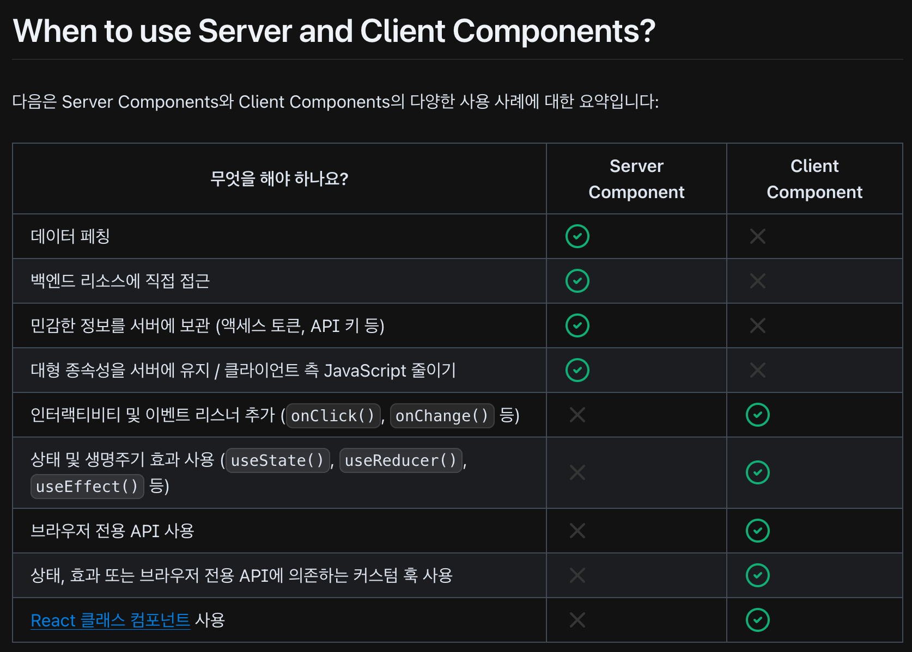

# Server Components

React Server Components를 사용하면 UI를 서버에서 렌더링하고 선택적으로 캐시할 수 있습니다. Next.js에서는 렌더링 작업이경
로 세그먼트별로 분할되어 스트리밍 및 부분 렌더링이 가능하며, 세 가지 다른 서버 렌더링 전략이 있습니다.

- Static Rendering (정적 렌더링)
- Dynamic Rendering (동적 렌더링)
- Streaming

## Benefits of Server Rendering

서버에서 렌더링 작업을 수행하면 몇 가지 이점이 있습니다.

- 데이터 페칭: 렌더링에 필요한 데이터를 가져오는 시간을 줄이고 클라이언트에서 요청해야 하는 횟수를 줄여 성능을 향상
- 보안: 토큰이나 API 키와 같은 민감한 데이터와 로직을 클라이언트에 노출될 위험 없이 서버에 유지 가능
- 캐싱: 서버에서 렌더링함으로써 결과를 캐시하고 이후 요청과 사용자 간에 재사용할 수 있습니다. 이는 각 요청 시 수행되는렌
  더링과 데이터 페칭의 양을 줄여 성능을 향상시키고 비용을 절감할 수 있습니다.
- 성능: Server Components는 성능을 최적화할 수 있는 추가 도구를 제공합니다. 예를 들어, 완전히 Client Components로 구성된
  앱에서 비인터랙티브 UI 부분을 Server Components로 이동하면 클라이언트 측 JavaScript의 양을 줄일 수 있습니다. 이는 느린
  인터넷 또는 성능이 낮은 장치를 사용하는 사용자에게 유리합니다.
- 초기 페이지 로드 및 First Contentful Paint (FCP): 서버에서 HTML을 생성하여 사용자가 페이지를 즉시 볼 수 있게 하고, 클
  라이언트가 페이지를 렌더링하는 데 필요한 JavaScript를 다운로드, 파싱 및 실행할 필요가 없습니다.
- 검색 엔진 최적화 및 소셜 네트워크 공유 가능성: 렌더링된 HTML은 검색 엔진 봇이 페이지를 인덱싱하고 소셜 네트워크 봇이페
  이지의 소셜 카드 미로보기를 생성하는 데 사용할 수 있습니다.
- 스트리밍: Server Components를 사용하면 렌더링 작업을 청크로 분할하고 준비되는 대로 클라이언트에 스트리밍할 수 있습니다
  .

## How are Server Components rendered

Next.js의 렌더링 작업은 개별 경로 세그먼트와 Suspense Boundaries에 따라 청크로 분할됩니다.

각 청크는 두 단계로 렌더링됩니다.

1. React는 Server Components를 **React Server Component Payload (RSC Payload)** 라는 특별한 데이터 형식으로 렌더링합니다
   .
2. Next.js는 RSC Payload와 Client Component JavaScript 지침을 사용하여 서버에서 HTML을 렌더링합니다.

그런 다음 클라이언트에서는:

1. HTML을 사용하여 경로의 빠른 비인터랙티브 미리보기를 즉시 표시합니다. - 이는 초기 페이지 로드에만 해당됩니다.
2. React Server Components Payload를 사용하여 Client와 Server Component 트리를 조정하고 DOM을 업데이트합니다.
3. JavaScript 지침을 사용하여 Client Components를 하이드레이션하고 애플리케이션을 인터랙티브하게 만듭니다.

### React Server Component Payload (RSC)란 무엇인가요?

RSC Payload는 렌더링된 React Server Components 트리의 간결한 이진 표현입니다. 이는 클라이언트에서 React가 브라우저의 DOM
을 업데이트하는 데 사용됩니다. RSC Payload에는 다음이 포함됩니다.

- Server Components의 렌더링된 결과
- Client Components가 렌더링되어야 할 위치와 해당 JavaScript 파일에 대한 참조
- Server Component에서 Client Component로 전달된 모든 props

## Server Rendering Strategies

서버 렌더링에는 세 가지 하위 집합이 있습니다: Static, Dynamic, Streaming

### Static Rendering (Default)

Static Rendering에서는 빌드 타임 또는 데이터 재검증 후 백그라운드에서 경로가 렌더링됩니다. 결과는 캐시되며 Content
Delivery Network (CDN)에 푸시될 수 있습니다. 이 최적화는 사용자와 서버 요청 간에 렌더링 작업의 결과를 공유할 수 있게 합
니다.

Static Rendering은 사용자에게 개인화되지 않은 데이터가 있으며 빌드 타임에 알 수 있는 경로(예: 정적 블로그 게시물 또는 제
품 페이지)에 유용합니다.

### Dynamic Rendering

Dynamic Rendering에서는 경로가 요청 시 각 사용자에 대해 렌더링됩니다.

Dynamic Rendering은 사용자에게 개인화된 데이터가있거나 요청 시에만 알 수 있는 정보(예: 쿠키 또는 URL의 검색 매개변수)가
있는 경로에 유용합니다.

> 캐시된 데이터가 있는 동적 경로
>
> 대부분의 웹사이트에서 경로가 완전히 정적이거나 완전히 동적이지 않습니다 - 이는 스펙트럼입니다. 예를 들어, 일정 간격으
> 로 재검증되는 캐시된 제품 데이터를 사용하는 전자 상거래 페이지와 개인화된 고객 데이터를 포함하는 경우가 있습니다.
>
> Next.js에서는 캐시된 데이터와 캐시되지 않은 데이터를 모두 사용하는 동적으로 렌더링된 경로를 가질 수 있습니다. 이는 RSC
> Payload와 데이터가 별도로 캐시되기 때문에 가능합니다. 이를 통해 모든 데이터를 요청 시 가져오는 성능 영향을 걱정하고 동
> 적 렌더링을 선택할 수 있습니다.
>
> 전체 경로 캐시 및 데이터 캐시에 대해 자세히 알아보세요.

---

일단 여기까지는 Document 내용..

내 나름 정리를 하면

- Server Component는 Next.js에서 `'use client';` 사용하지않으면 기본적으로 서버 컴포넌트
- SSR(Server Side Rendering)의 이점은
  - 성능(Data Fetching, Caching), 보안, 검색엔진 최적화, 스트리밍
- 데이터를 서버 컴포넌트에서 페칭(클라이언트에서 요청하는 횟수를 줄임), 캐싱함으로써 성능을 향상시킴
- 클라이언트 측에 데이터와 로직을 노출될 위험 없이 서버에 유지함으로써 안전
- 서버에서 HTML을 생성하여 초기 페이지 로드 속도 향상 및 검색 엔진 최적화 가능
- `RSC Payload` 라는 데이터 형식으로 렌더링.
  - 서버 컴포넌트의 렌더링된 결과
  - 클라이언트 컴포넌트가 렌더링되어야 할 위치, 해당 JavaScript 파일에 대한 참조
  - 서버 컴포넌트에서 클라이언트 컴포넌트로 전달된 모든 props
- 서버 컴포넌트 렌더링
  - **RSC Payload**와 **클라이언트 컴포넌트 JavaScript 지침**을 사용하여 서버에서 HTML 렌더링
- 클라이언트 컴포넌트 렌더링
  1. HTML을 사용해 경로의 빠른 비인터랙티브 미리보기 표시
  1. RSC Payload로 Tree 조정 -> DOM Update
  1. 클라이언트 컴포넌트 하이드레이션(클라이언트 측에서 JavaScript를 통해 동적으로 활성화하는 과정)
- 위 렌더링 과정은 Next.js에서의 렌더링 과정이고 브라우저에서 JavaScript를 컴파일하고 렌더링하는 과정은 따로 정리가 필요
- 정적 렌더링(Default)에서는 빌드 타임 또는 데이터 재검증 후 백그라운드에서 경로가 렌더링
  - 데이터 재검증: 일정 기준으로 캐시를 비우고 최신 데이터를 가져오는 것
- 동적 렌더링은 경로가 요청 시 각 사용자에 대해 렌더링
  - 클라이언트 측의 조작으로 서버에서 렌더링이 발생하는 것
- 동적 렌더링 전환은 동적 함수, 캐시되지 않은 데이터 요청이 발견되면 전체 경로 동적으로 렌더링하도록 전환

<br /><br />



---

### 의문점

Q1. 라이트/다크모드 지원하려면 `layout.tsx`에 'use client' 선언하고 클라이언트 컴포넌트로 만드는데 공식 문서에는
`클라이언트에서 렌더링해야 하는 모든 컴포넌트에 "use client"를 정의할 필요는 없습니다. 한 번 경계를 정의하면 모든 자식 컴포넌트와 import된 모듈이 클라이언트 번들의 일부로 간주됩 니다.`라
는 문구가 있다. 그럼 최상위 컴포넌트인 `layout.tsx`가 클라이언트 컴포넌트면 그 프로젝트 전체는 클라이언트 컴포넌트가 되
는게 아닌가?

A1.

- 첫번째로 라이트/다크모드를 클라이언트 컴포넌트로 하는 방법도 있지만 아닌 방법도 있다.
  1. CSS를 이용
  2. 테마 라이브러리를 이용
  3. Cookie에 테마정보를 저장
- 두번째가 중요한 것 같다. children 컴포넌트는 props로 받아 렌더링을 할 때는 독립적으로 렌더링이 진행된다.
  - `{children}`을 랩핑한 컴포넌트가 클라이언트 컴포넌트, `{children}`이 서버 컴포넌트이면 각각 독립적으로 클라이언트 컴
    포넌트는 클라이언트에서, 서버 컴포넌트는 서버에서 렌더링이 된다.
  - 하지만, `{children}`으로 전달한게 아닌 `<><Server/></>`와 같은 방식으로 호출할 경우 에러가 발생한다.

#### 예시

```tsx
// client-component.tsx
'use client';
...
const Client: React.FC<ClientProps> = ({ children }) => {
  return (
    <>
      {children}
    </>
  )
}
...

// server-component.tsx
const Server: React.FC = () => {
  return <>Server</>
}
...

// page.tsx
const Page: React.FC = () => {
  return (
    <Client> {/** client rendering */}
      <Server/> {/** server rendering */}
    </Client>
  )
}

export default Page;
```

테스트 중 문제 발생..

```tsx
// page.tsx
'use client';
const Page: React.FC = () => {
  return (
    {/* client rendering */}
    <Client>
      <Server /> {/** client rendering */}
    </Client>
  );
};
```

위 예시 처럼 Page가 클라이언트 컴포넌트일 경우 Server가 Client Rendering 되는 문제 발생..

정확한 이유를 찾을 수가 없지만 생각나는 바로는

1. 클라이언트 컴포넌트에서 다른 컴포넌트를 호출하면 해당 컴포넌트는 클라이언트 번들에 포함된다 (클라이언트 렌더링)
1. 따라서 `{children}`으로 건내더라도 `Server`은 부모 클라이언트 컴포넌트에 영향을 받아 클라이언트 번들에 포함
1. 문제 발생하기 전 코드처럼 부모 서버 컴포넌트에서 `Client`를 호출하고 `{children}`으로 `Server`을 건내야 원하는대로 동
   작한다.

> 이유 찾음
>
> Client Components는 Server Components 이후에 렌더링되므로, 클라이언트 컴포넌트 모듈에 Server Component를 import할 수없
> 습니다(이는 서버로의 새로운 요청이 필요함). 대신, Server Component를 props로 Client Component에 전달할 수 있습니다. 아
> 래의 지원되지 않는 패턴 및 지원되는 패턴 섹션을 참조하세요.

[링크](https://nextjs-ko.org/docs/app/building-your-application/rendering/composition-patterns#unsupported-pattern-importing-server-components-into-client-components)
