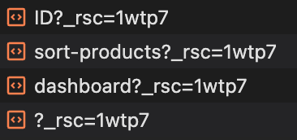

## How Routing and Navigation Works

<strong>※ 라우팅 및 내비게이션 작동 방식</strong>

App Router는 라우팅 및 내비게이션에 대해 하이브리드 접근 방식을 사용합니다.

1. 서버에서 애플리케이션 코드는 경로 세그먼트에 의해 자동으로 코드 분할됩니다.
2. 클라이언트에서 Next.js는 경로 세그먼트를 사전 로드하고 캐시합니다.
3. 사용자가 새 경로로 내비게이션할 때 브라우저가 페이지를 다시 로드하지 않으며 변경된 경로 세그먼트만 다시 렌더링됩니다.

이는 내비게이션 경험과 성능을 향상시킵니다.

### 1. Code Splitting

- `코드분할`은 애플리케이션 코드를 더 작은 번들로 나누어 브라우저가 다운로드하고 실행할 수 있게 합니다.
  - 이는 전송되는 데이터 양과 각 요청에 대한 실행 시간을 줄여 성능을 향상시킵니다.
- 웹 페이지가 요청될 때, 즉 HTML 다운로드와 함께 일어납니다.
  - 서버에서 필요한 코드만 전송하여 초기 로딩시간을 줄이고, 사용자 상호작용에 따라 추가 코드가 필요할 때만 로드하도록 합
    니다.
  - HTML 다운로드 단계에서 발생하지만, 필요한 리소스가 동적으로 로드될 때도 발생합니다.

### 2. Prefetching

- 사전 로드는 사용자가 방문하기 전에 백그라운드에서 경로를 미리 로드하는 방법입니다.
- **`<Link>` 컴포넌트**
  - 경로가 사용자의 뷰포트에 보이게 되면 자동으로 사전 로드됩니다. 사전 로드는 페이지가 처음 로드될 때 또는 스크롤을 통
    해 뷰에 들어올 때 발생합니다.
- **router.prefetch()**
  - useRouter 훅을 사용하여 프로그래밍 방식으로 경로를 사전 로드할 수 있습니다.

 

- `<Link>`의 기본 사전 로드 동작(즉, prefetch prop이 지정되지 않았거나 null로 설정된 경우)은 loading.js의 사용 방식에 따
  라 다릅니다.
- 첫 번째 loading.js 파일까지 렌더링된 "트리"의 공유 레이아웃만 사전 로드되어 30초 동안 캐시됩니다.
  - 이는 전체 동적 경로를 가져오는 비용을 줄여주며, 사용자에게 더 나은 시각적 피드백을 제공하기 위해 즉각적인 로딩 상태
    를 표시할 수 있습니다.

   

`<Link>` 태그로 감싼 버튼에 Hover시 해당 내용을 Prefetching (IOS, Chrome기준 3분정도 캐시되는 것으로 보임)

> 참고 : 사전 로드는 개발 환경에서는 활성화되지 않으며, 프로덕션 환경에서만 활성화됩니다.

### 3. Caching

- Next.js에는 라우터 캐시라고 불리는 메모리 내 클라이언트 측 캐시가 있습니다.
- 사용자가 애플리케이션을 탐색할 때 사전 로드된 경로 세그먼트와 방문한 경로의 React 서버 컴포넌트 페이로드가 캐시에 저장
  됩니다.

### 4. Partial Rendering

- 부분 렌더링은 내비게이션 시 변경된 경로 세그먼트만 클라이언트에서 다시 렌더링되고, 공유된 세그먼트는 유지되는 것을 의
  미합니다.
  - 예를 들어, 두 형제 경로인 `/dashboard/settings`와 `/dashboard/analytics` 간 내비게이션할 때 settings와 analytics 페
    이지가 렌더링되고, 공유된 dashboard 레이아웃은 유지됩니다.
- 부분 렌더링이 없다면, 각 내비게이션은 전체 페이지를 클라이언트에서 다시 렌더링하게 됩니다.
  - 변경된 세그먼트만 렌더링하면 전송되는 데이터 양과 실행 시간을 줄여 성능을 향상시킬 수 있습니다.

### 5. Soft Navigation

- 브라우저는 페이지 간 내비게이션 시 `하드 내비게이션`을 수행합니다. Next.js App Router는 페이지 간
  `소프트 내비게이션`을 가능하게 하여 변경된 경로 세그먼트만 다시 렌더링되도록 합니다(부분 렌더링). 이를 통해 내비게이션
  중 클라이언트 React 상태가 유지됩니다.

### 6. Back and Forward Navigation

- 기본적으로 Next.js는 뒤로 및 앞으로 내비게이션을 위해 스크롤 위치를 유지하고 라우터 캐시의 경로 세그먼트를 재사용합니
  다.
